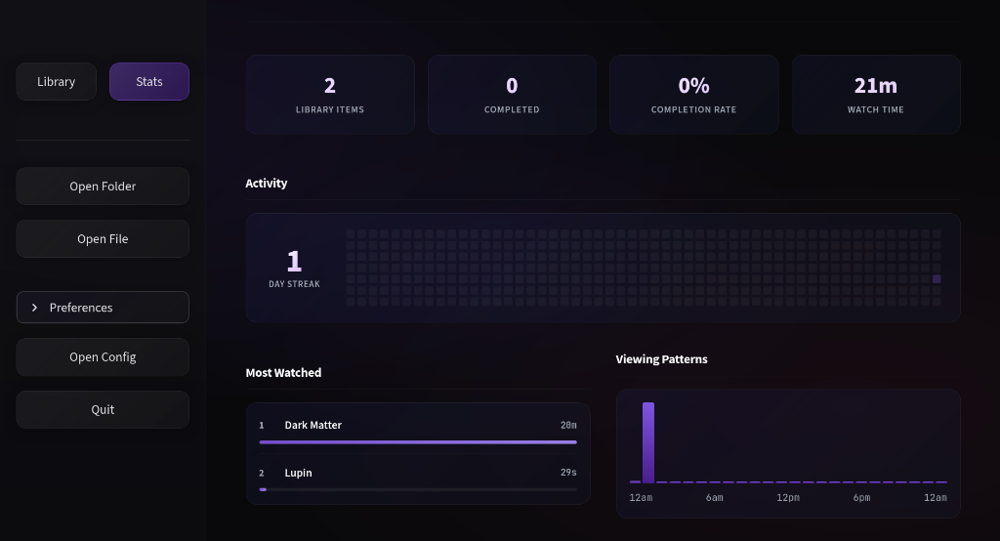

# Cue ⏯️

**Cue** is a premium, cross-platform media dashboard that remembers exactly where you left off. It acts as a smart central hub for your local media, tracking playback progress with automated metadata enrichment and a beautiful statistics dashboard.

### Library View


### Stats View



## ✨ Features

- **Universal Resume:** Remembers playback position for any video file.
- **Beautiful UI:** Modern, immersive interface with glassmorphism and smooth animations.
- **Media Enrichment:** Automatically fetches posters, ratings, and descriptions via TMDB API.
- **Stats Dashboard:** Track your viewing patterns, day streaks, and watch time in a sleek dashboard.
- **Cross-Platform:** Works natively on **Windows** (mpv) and **Linux** (Celluloid or mpv).
- **Folder Support:** Intelligently resumes entire folders (series/playlists) from the exact file you stopped at.
- **Driver System:** Configurable backend to support both CLI players (STDOUT) and GUI wrappers (IPC Sockets).

## 🛠️ Prerequisites

1.  **Python 3.10+**
2.  **Media Player:**
    - _Windows:_ [mpv](https://mpv.io/)
    - _Linux:_ [Celluloid](https://github.com/celluloid-player/celluloid) OR [mpv](https://mpv.io/)
3.  **TMDB API Key:** Required for automatic metadata fetching.

## 📦 Installation

1.  Clone or download this repository.
2.  Install the required Python libraries:
    ```bash
    pip install -r requirements.txt
    ```
    Create a `.env` file in the root directory:
    ```bash
    TMDB_API_KEY="your_api_key_here"
    ```
3.  Run the application:
    ```bash
    streamlit run main.py
    ```

## ⚙️ Configuration

**Cue** attempts to auto-detect your operating system on first run.

### Windows 🪟

- **Default Player:** `mpv`
- **Driver Mode:** `mpv_native`

### Linux 🐧

- **Default Player:** `celluloid`
- **Driver Mode:** `celluloid_ipc`

## 🚀 Usage

1.  Click **Open File** or **Open Folder**.
2.  Select your media.
3.  Watch!
4.  Close the player when you are done.
5.  **Cue** will automatically save your spot and update your stats.
