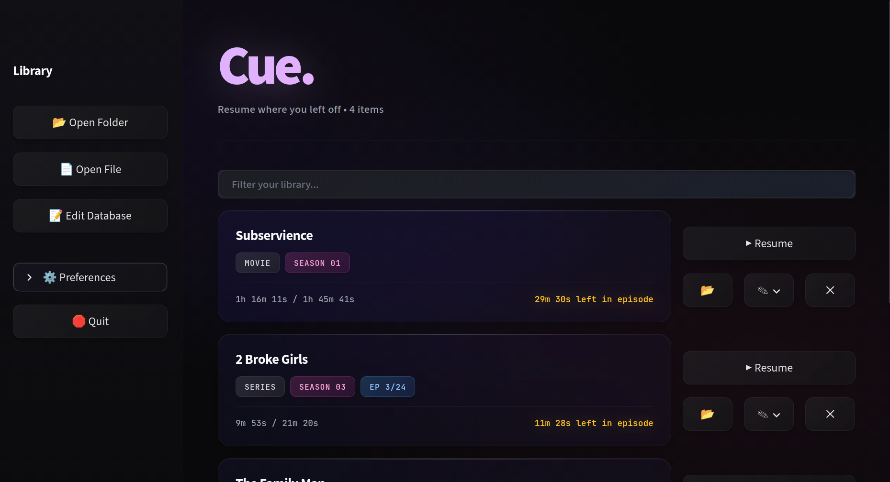

# 🎬 celluloidRecall

**Resume your media exactly where you left off, seamlessly.**

`celluloidRecall` is a simple yet powerful tool that leverages [celluloid](https://celluloid-player.github.io/) (a free, open-source media player) and [Streamlit](https://streamlit.io/) to provide a user-friendly interface for resuming your video and audio playback. Whether you're watching a long movie, a series of episodes, or listening to an album, `celluloidRecall` remembers your last position, allowing you to pick up right where you left off.

---

## ✨ Features

- **Automatic Resume:** Continues playback from the exact point you stopped — for both single files and folder playlists.  
- **Folder Playback Support:** Select a folder and `celluloidRecall` will play all media files within it. Remembers the last played file *and* its position in the playlist.  
- **Simple User Interface:** Clean and intuitive web UI powered by Streamlit.  
- **Cross-Platform (Linux/macOS):S** Designed primarily for Linux and macOS using `celluloid` and `zenity` for file selection.  
- **Persistent State:** Stores last played info in `~/.cache/celluloid_recall_last.json` for seamless session recall.

---

## 🚀 How to Use

### Prerequisites

Ensure the following are installed:

1. **Python 3.x**  
2. **celluloid**  
   - Linux: `sudo apt install celluloid`  
   - macOS: `brew install celluloid`  
3. **Zenity** (used for file/folder picker dialogs)  
   - Linux: `sudo apt install zenity`  
   - macOS: `brew install zenity`  

### Installation & Running

1. **Save the code:**  
   Save the Python code into a file named `celluloid_recall_app.py`.

2. **(Optional) Create a Virtual Environment:**

    ```bash
    python3 -m venv venv
    source venv/bin/activate
    ```

3. **Install dependencies:**

    ```bash
    pip install streamlit
    ```

4. **Run the app:**

    ```bash
    streamlit run celluloid_recall_app.py
    ```

This will open `celluloidRecall` in your default web browser.

---

## 💡 Usage Guide

1. **Initial Launch:**  
   If no previous data is found, you'll be prompted to play something new.

2. **Select Media:**  
   - **📄 Select File:** Choose a single video or audio file.  
   - **📁 Select Folder:** Choose a directory containing multiple media files.  

3. **Play Media:**  
   Click **▶️ Play Selection** to launch `celluloid` with your chosen file/folder.

4. **Resuming Playback:**  
   - Upon closing `celluloid`, your last played file and timestamp are saved.  
   - The next launch of `celluloidRecall` will show the **🔄 Resume Last Session** section.  
   - Click **▶️ Resume Last Session** to pick up from where you left off.


---

## Credits

- Built using [celluloid](https://celluloid-player.github.io/) and [Streamlit](https://streamlit.io/)  
- File dialogs powered by [Zenity](https://help.gnome.org/users/zenity/stable/index.html.en)


